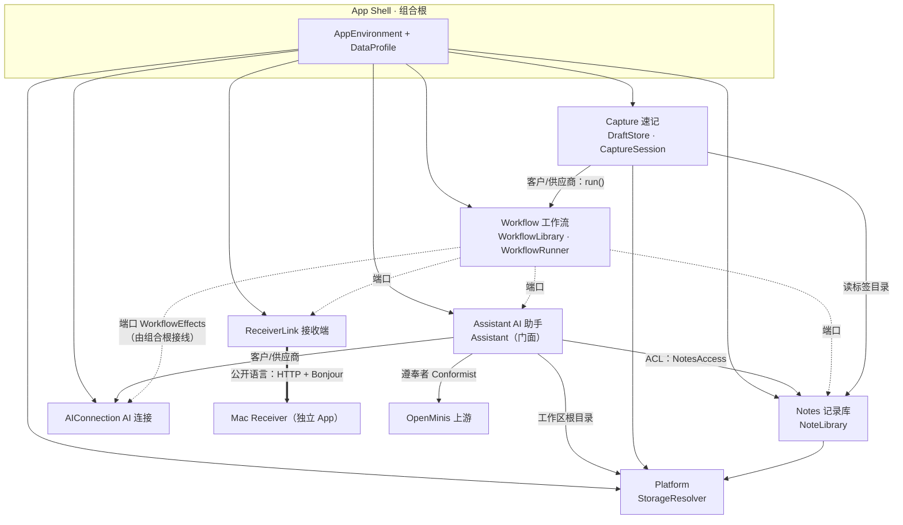

# 深模块重构方案：按限界上下文重划边界，消除散弹式修改

> 视角：Ousterhout《A Philosophy of Software Design》的战略式编程 + DDD 限界上下文。
> 范围：`apps/ios`（约 1.4 万行 Swift/ObjC）为主，`apps/macos` 只涉及两端协议。
> 状态：§9 的三项决策已拍板，§9 列出的缺陷已修复（见该节）；各迁移阶段尚未开始。
> 文中行号基于 `29ae25a`，修复之后部分行号已偏移。

## 1. 结论先行

代码的问题不在「文件太大」，而在**知识没有唯一的家**。同一条设计决策（记录文件格式、AI 凭证怎么解析、步骤类型有哪些、数据存在哪、现在是不是演示模式）被多个文件各自知道一份，于是改一条决策就要改一串文件。

重构的主线只有三条：

1. **按「谁因为同一个原因而变」划出 6 个限界上下文**，每个上下文对外只露一个深模块（接口小、实现厚）。
2. **跨上下文的依赖只走两种通道**：组合根注入，或由调用方上下文定义的窄端口（ACL）。不再有 `X.shared` 横向直连。
3. **把策略从 View 和「Manager」里沉到模块内部**（pull complexity downward）：提交草稿的回滚策略、刷新/同步策略、标签索引一致性，调用方都不该知道。

预期收益用一张表衡量（详见 §5）：九类常见改动，今天平均要碰 4～7 个文件，重构后收敛到 1 个上下文内、且多数由编译器引导。

## 2. 诊断：复杂度从哪里来

Ousterhout 把复杂度的症状归为三类：变更放大、认知负担、未知的未知。下面按根因列证据。

### 2.1 git 历史里的变更放大（实证）

406 个提交里，改动热点与共变关系（文件名已按现名换算）：

| 特性级提交 | 碰到的 Swift 文件 |
|---|---|
| `15f0a98` 增加演示模式 | **11 个**（2 个新增 + 9 个既有）：3 个 Agent Store、权限管理器、主页、NoteStore、SettingsView、App 入口、WorkflowManager |
| `f67ff86` 移除 Auto Paste | 5 个：App 入口(−386)、WorkflowManager、WorkflowConfigView、主页、NoteStore |
| `07e5f50` iCloud 同步与本地回落 | 5 个：NoteStore、记录页、主页、App 入口、ICloudNotesStorage |
| `dd5099e` Bonjour 发现 | 4 个：WorkflowManager、WorkflowConfigView、App 入口、BonjourDiscovery |

仅统计迁入 `apps/ios` 之后的历史：`QuickCaptureView`（原 ContentView）以 34 次修改居首，且与记录页(8 次同提交)、工作流配置页(6)、NoteStore(5)、App 入口(5) 高频共变——主页是各种策略的汇聚点。

### 2.2 信息泄漏：同一条知识的多个副本

| 知识 | 副本所在 |
|---|---|
| 记录文件格式（front matter、`yyyy-MM-dd-HHmm-ss`、`_draft.md`） | `NoteStore.swift:473-527, 904-930, 1610-1616`；`DemoSeedData.swift:405-431`（整份重写了一遍）；`ICloudNotesStorage.swift:35-50` |
| 「设置 → 可用的 AI 端点」（trim 密钥、规范化地址、模型兜底） | `AIService.swift:17-20, 37-53`；`AgentChatView.swift:95-108`；`WorkflowManager.swift:548-559` |
| AI 失败的错误词汇 | `AIServiceError`（`AIService.swift:413`）与 `LLMError`（`AgentProvider.swift:171`）两套；主页靠类型嗅探区分：`QuickCaptureView.swift:182` |
| 步骤类型的全部含义 | `WorkflowManager.swift:10-36, 45-52, 78-95, 442-480`；`WorkflowConfigView.swift:655-678, 738-752, 763-789, 1172-1180`；`QuickCaptureView.swift:498-503`；`DemoSeedData.swift` |
| 接收端协议（`POST /`、`POST /send`、默认端口） | `WorkflowManager.swift:456-468` 与 `509-519` 逐字重复；默认端口 iOS 曾写 **9999**（4 处），Mac 监听 **7788**（`AppDelegate.swift:132`）。端口**已统一**（§9）；请求代码的重复留给阶段 4 |
| 刷新策略「回落或有待下载就重估存储，否则按需加载」 | `QuickCaptureView.swift:545-550` 与 `NoteLibraryView.swift:457-462` 逐字重复；`VibeTakingApp.swift:23-25` 还要知道 `hasLoadedNotes` |
| 记录搜索语义 | UI：`NoteLibraryView.swift:130-136`（`localizedStandardContains`）；Agent：`NoteTools.swift:91-104`（`lowercased().contains`）——两套实现、语义不同。**已修复**：收进 `NoteSearch.swift` |
| UserDefaults 键名 | `workflows_v2`/`selectedWorkflowId`/`agentMemoryEnabled` 在各 Store 与 `DemoSeedData.swift:400-403` 各写一遍；`aiBaseURLString` 在 `SettingsView.swift:16` 与 `:116` 各写一遍 |
| 工具元数据 | 工具名→中文标题在 `AgentChatView.swift:63-79`；设备命令清单在 `OffloadPermissionManager.swift:92-96`；工具名硬编码在系统提示词里 |

### 2.3 手工维护的不变量（未知的未知）

- **标签索引 = f(已保存记录)** 这条不变量靠 `NoteStore` 里 15 处对 `TagIndex.shared` 的手工推送维持（13 处 `refreshTags` + 2 处 `apply(snapshot:)`），而且曾经不一致：`addRecord`/`deleteRecord*`/`clearAll` 传的是含草稿的 `items`，其余传 `savedItems`，草稿带标签时两条路径算出的计数不同。计数不一致已修复（§9）；15 处手工推送这个结构问题留给阶段 3。
- **演示模式** 是一个环境级全局量：每个 Store 必须记得用 `AppDefaults.current` 而不是 `UserDefaults.standard`，还必须被登记进 `DemoModeManager.reloadManagers()`（`DemoModeManager.swift:65-72`）。漏掉任何一处都不会有编译错误。
- **Agent 装配的时序耦合**：造 provider → `noff_set_storage_root` → 造 registry → 拼系统提示词 → `engine.run`，这五步被 `AgentChatViewModel` 和 `WorkflowManager.executeAgentNode` 各背一遍；领域服务还反向依赖了视图模型（`WorkflowManager.swift:562` 调 `AgentChatViewModel.makeDefaultRegistry()`）。

### 2.4 模型把两个概念压成一个

`Note.isDraft` 让「草稿」（唯一、可变、可撤销的输入缓冲）和「记录」（以文件名为身份的持久条目）共用一个类型和一个数组。后果：

- 所有消费者都要过滤 `!isDraft`（`savedItems`、`hasSavedItems`、`NoteListCache.build`、各 Agent 工具）；
- `currentDraft` 的 getter 会修改 `items`（`NoteStore.swift:237-244`）；
- §2.3 的标签计数不一致正是这个压缩的直接产物。

### 2.5 浅接口与穿透变量

- `NoteStore` 公开约 40 个成员，其中 6 个标签方法（`addTag/removeTag/toggleTag/batchAddTag/batchRemoveTag/renameTag`）各自重复同一段「草稿则…否则…再刷新索引」的尾巴；5 个加载入口（`loadItems/loadItemsIfNeeded(force:reevaluateStorage:)/refresh/refreshFromEnvironment/switchDataset`）把内部状态机摊给调用方；4 个布尔状态可以组合出无意义的状态。
- `WorkflowExecutionResult.tags` 是穿透变量：传进去原样传出来。`.save` 步骤并不保存，只是举个旗 `shouldSave`，真正的保存、以及「清草稿 → 执行 → 保存或回滚 → 串行排队」这套提交策略，写在 `QuickCaptureView.swift:598-717` 的 `@State` 里。
- `addRecord` 曾不返回新建的记录，`SaveNoteTool` 只好按正文反查；还隐含「同正文旧记录被替换」的去重，接口上看不出来。两点均已修复（§9 决策 2）。

### 2.6 可直接删除的死代码

零调用：`NoteStore.getItems(filteredBy:)`、`getSavedItems(filteredBy:)`×2、`loadItems()`、`refresh()`、`clearAll()`、`deleteRecords(at:)`、`toggleTag(for:tagName:)`；`TagIndex.getTag(by:)`；`WorkflowManager.normalizedPort`、`saveNodes()`。
（`AgentEngine.replaceHistory`、`OffloadPermissionManager.resetSessionGrants` 同样零调用，但属于移植代码，按 §3.2 的遵奉者原则保留。）
形同虚设：`WorkflowManager.normalizeNodes`（空函数体，4 处调用）、`executionError`（只写不读）。
已移除：`WorkflowKind`（含 `autoPasteSync`）、`isActive`、`syncConfig`，以及加载时丢弃旧工作流之后恒为真的 10 处 `kind == .manual` 判断（`WorkflowManager` 8 处、主页 2 处；§9 决策 3）。

## 3. 限界上下文与上下文映射

### 3.1 划分依据

判断标准是「语言在哪里变、变更原因在哪里分叉」，不是技术分层。通用语言沿用 `DESIGN.md` 已确立的词汇：草稿、记录、标签、工作流、步骤、对话、专注模式。

| 上下文 | 子域类型 | 它的语言 | 变更原因 |
|---|---|---|---|
| **Capture 速记** | 核心 | 草稿、清除/恢复、提交、专注模式 | 输入体验、提交与回滚策略 |
| **Notes 记录库** | 核心 | 记录、标签、搜索、导入/导出、同步状态 | 文件格式、同步、检索、标签体系 |
| **Workflow 工作流** | 核心 | 工作流、步骤、运行、结果 | 新步骤类型、编排规则 |
| **Assistant AI 助手** | 支撑（移植自 OpenMinis） | 对话、工具、记忆、技能、设备权限 | 上游演进、新工具 |
| **AIConnection AI 连接** | 通用 | 密钥、服务地址、模型、补全 | 换服务商、鉴权方式、错误文案 |
| **ReceiverLink 接收端** | 支撑 | 接收端、发现、发送、回车指令 | 两端协议 |
| Platform（非上下文） | 基础设施 | 数据档、存储根、工作区 | iCloud/本机/演示的解析规则 |
| App Shell（非上下文） | 组合根 | — | 装配关系 |

Mac 端是独立的第七个上下文（接收、粘贴、历史），只通过 ReceiverLink 的协议与 iOS 相连。

### 3.2 上下文映射



关系说明：

- **Workflow 不 import 其他上下文**。它只声明自己需要的五个效果（改写、助手、复制、发送、保存），由组合根用其他上下文的能力来填。依赖方向被反转，Workflow 可以脱离全 App 单测。
- **Assistant → Notes 走防腐层**。工具说的是「文件名 + 格式化字符串」，Notes 说的是 `Note`，翻译集中在一处。
- **Assistant 对 OpenMinis 是遵奉者**：引擎、Provider、Preflight、LoopDetector、ObjC offload 内部**不重构**，只在边界包一层门面。这样上游更新仍可对比合并，GPL 衍生声明也保持清晰。
- **两种公开语言**需要固化并加兼容性检查：配置导出包（`AppConfigurationPackage` schema v1，含旧键 `apiToken`/`selectedWorkflowId`）、接收端 HTTP 协议。
- **演示模式不是上下文**，是组合根的一个 `DataProfile`。`DemoSeedData` 变成各上下文公开 API 的普通客户，不再自带格式和键名副本。

## 4. 深模块设计

原则：每个上下文对外一个门面；接口比今天小一个数量级，藏住的东西比今天多。只在**需要反转依赖方向的上下文边界**才引入端口，其他地方直接用具体类型——给每个类配一个协议是浅模块的典型来源。

### 4.1 Notes · `NoteLibrary`

```swift
@MainActor @Observable
final class NoteLibrary {
    // 读模型
    private(set) var notes: [Note]          // 只含已保存记录，时间倒序，ID 跨重载稳定
    private(set) var tags: TagCatalog       // 由 notes 派生，全库唯一计算点
    private(set) var status: LibraryStatus  // .loading | .ready(downloading: Bool) | .localFallback

    // 命令
    @discardableResult
    func save(text: String, tags: [String]) throws -> Note
    func delete(_ ids: Set<Note.ID>)
    func retag(_ ids: Set<Note.ID>, _ edit: (inout [String]) -> Void)
    func renameTag(_ old: String, to new: String)
    func refresh()                          // 幂等、自合并；调用方不再区分 load / reevaluate
    func search(_ query: NoteQuery) -> [Note]
    func importNotes(from urls: [URL]) async throws -> ImportSummary
    func exportArchive() async throws -> URL
}
```

藏在里面、对外不可见的：

| 内部模块 | 职责 | 来源 |
|---|---|---|
| `NoteDocument`（`nonisolated`，纯函数） | front matter 编解码、时间戳文件名、`_draft.md` 常量 | `NoteStore` 的 parse/generate + `DemoSeedData` 的副本 + `ICloudNotesStorage` 的日期格式 |
| `DirectoryScanner` | 列目录、占位符、并行解析、stamp 缓存命中 | `loadItemsFromDisk` 一族 |
| `CloudSyncMonitor` | `NSMetadataQuery`、签名去抖、触发下载 | `NoteStore.swift:1282-1410` |
| `NoteSnapshotStore` | 冷启动快照 | 现有，保持 |
| `NotesArchive` + `ZipArchiveReader` | 导入/导出；ZIP 读取器是零领域知识的通用模块 | `NoteStore.swift:1412-1800` |
| `NoteQuery` | 关键词 AND、标签正/反选、无标签 | `NoteListCache` 与 `SearchNotesTool` 两套实现合一 |
| `TagRecommender` | 分词、相似样例挑选、提示词、结果清洗；`complete` 闭包注入 | `AIService.swift:79-349`（它不是 AI 连接的事，是标签领域服务） |

接口变化：约 40 个公开成员 → 10 个（草稿相关的约 10 个移交 `DraftStore`）；5 个加载入口 → `refresh()`；6 个标签方法 → `retag` + `renameTag`；4 个布尔 → 1 个枚举（无效组合不可表示）；`save` 返回 `Note`，`SaveNoteTool` 的按正文反查消失。

`TagCatalog` 在 `notes` 的 `didSet` 一处派生，15 个手工调用点和 §2.3 的不一致一起消失——这是「把错误定义掉」，不是「更小心地维护」。

### 4.2 Capture · `DraftStore` 与 `CaptureSession`

```swift
@MainActor @Observable
final class DraftStore {
    private(set) var draft: Draft           // text + tags，永远存在，不再混在记录数组里
    var canRestore: Bool { get }
    func setText(_ text: String)            // 去抖落盘、乱序丢弃，调用方无感
    func setTags(_ tags: [String])
    func clear()                            // 可撤销
    func restore()
    func take() -> Draft?                   // 原子取走：清空并记入撤销缓冲
    func flush()                            // 场景失活时调用
}

@MainActor @Observable
final class CaptureSession {
    private(set) var running: Workflow.ID?
    private(set) var progress: StepProgress?
    private(set) var notice: CaptureNotice?     // .status(String) | .failure(SubmissionFailure)
    var focusedWorkflowID: Workflow.ID?         // 专注模式，随数据档持久化
    func submit(to workflow: Workflow)          // 串行管线、失败回滚、空草稿发回车，全部内聚
}
```

`SubmissionFailure` 自带标题、正文、上下文（「原文已恢复」「前面的步骤可能已完成」）和 `suggestsAISettings`，主页不再嗅探错误类型，也不再读 `workflowManager.currentNodeIndex` 来推断进度。

`QuickCaptureView` 留下的只有渲染、键盘与焦点、无障碍——这些才是它高频变化的真实原因。`TagPickerView(noteID:)` 改收一个 `TagEditingTarget`（当前标签 + 应用闭包），不再关心标签属于草稿还是记录。

### 4.3 Workflow · 步骤模型、`WorkflowLibrary`、`WorkflowRunner`

**步骤用带关联值的枚举**，替换「类型枚举 + 五个可选字段的配置袋」：

```swift
struct WorkflowStep: Identifiable, Codable, Equatable {
    let id: UUID
    var isEnabled: Bool
    var kind: Kind

    enum Kind: Equatable {
        case rewrite(instruction: String)     // 线上格式仍是 "ai_process" + config.aiPrompt
        case assistant(instruction: String)   // "agent" + config.agentPrompt
        case copy                             // "copy"
        case save                             // "save"
        case deliver(ReceiverTarget)          // "http_post" + config.httpHost/httpPort/httpServiceName
    }
}
```

自定义 `Codable` 保持既有 JSON 形状，`workflows_v2` 与导出包 v1 双向兼容（先用检查脚本钉住，见 §7 阶段 0）。

每种步骤的全部知识收进上下文内三处、且全部是穷尽 `switch`（编译器会指路）：

1. `WorkflowStep+Catalog.swift`：名称、图标、说明、摘要行、校验、是否可编辑。
2. `WorkflowRunner`：执行。
3. `StepEditor`：编辑表单。

**规则：对 `Kind` 的分支只允许出现在 Workflow 上下文内。** 外部想知道什么，就问工作流：`workflow.issue`、`workflow.emptyInputAction`（取代主页对 `.httpPost` 的判断）。

```swift
struct WorkflowEffects {                       // Workflow 定义，组合根接线
    var rewrite:   (_ text: String, _ instruction: String) async throws -> String
    var assistant: (_ text: String, _ instruction: String) async throws -> String
    var copy:      (_ text: String) -> Void
    var deliver:   (_ text: String, _ target: ReceiverTarget) async throws -> Void
    var saveNote:  (_ text: String, _ tags: [String]) throws -> Void
}

struct WorkflowRunner {
    let effects: WorkflowEffects
    func run(_ workflow: Workflow, text: String, tags: [String],
             onStep: (StepProgress) -> Void) async throws -> WorkflowOutcome
    func runEmpty(_ workflow: Workflow) async throws -> Bool   // 空草稿：发回车
}
// WorkflowOutcome { finalText, didCopy, didSave }；失败抛 WorkflowFailure { stepIndex, underlying }
```

用一个闭包结构体而不是五个协议：量级相称、测试时填假实现即可、不产生浅接口。「全部步骤成功后才保存」的延迟语义由 Runner 内部保证，`shouldSave` 和穿透的 `tags` 从结果里消失。

`WorkflowManager` 拆成两个各自内聚的模块：`WorkflowLibrary`（定义、排序、开/关、选中、持久化、配置导入导出；不变量「至少一个工作流、至少一个打开」收在内部）与 `WorkflowRunner`（无状态执行）。今天混在里面的 HTTP 请求、Bonjour 解析、Agent 装配分别归还给 ReceiverLink 与 Assistant。

### 4.4 Assistant · `Assistant` 门面

```swift
@MainActor
final class Assistant {
    func conversation(resuming session: AgentChatSession? = nil) -> AssistantConversation
    func runOnce(instruction: String, input: String) async throws -> String   // 供工作流步骤用
    var tools: [ToolDescriptor] { get }      // name、displayTitle、设备权限信息：工具元数据的唯一来源
}
```

- 五步装配时序收进门面，聊天页与工作流都只调一个方法；`WorkflowManager → AgentChatViewModel` 的反向依赖消失。
- `AgentTool` 协议补上 `displayTitle`；设备类工具自带 `OffloadCommandInfo`。`toolDisplayName` 的 `switch` 与 `allCommands` 静态表改为从注册表派生。新增工具 = 新文件 + 一行注册。
- 工具通过 `NotesAccess`（Assistant 定义的闭包结构体：`search / note(fileName) / save / addTags / tagCounts`）访问记录库，不再直连 `NoteStore.shared`。
- 记忆、技能、会话三个 Store 的目录从 `StorageResolver.current.root` 注入；`noff_set_storage_root` 只在存储根变化时调用一次，不再由两个调用方各记一遍。
- `AgentChatViewModel`、`AgentToolkitExtras` 搬出视图文件。
- **不动的**：`AgentEngine`、`OpenAIResponsesAgentProvider`、`ToolPreflight`、`ToolLoopDetector`、`NativeOffloads/*`。

### 4.5 AIConnection

```swift
@MainActor @Observable
final class AIConnection {
    var settings: AISettings                 // baseURL、modelID、apiKey（Keychain）
    var isConfigured: Bool { get }
    func complete(instructions: String, input: String) async throws -> String
    func availableModels() async throws -> [AIModel]
    func agentProvider() throws -> AgentProvider
}
```

「trim 密钥 → 规范化地址 → 模型兜底 → 缺失则抛错」只存在于一个私有方法里。`AIServiceError` 并入 `LLMError`，加一个 `isConfigurationProblem`；`UserFacingError` 的 HTTP/流式映射保留为它的内部实现。`AISettingsStore` 从 `SettingsView.swift` 搬出来。各视图里散落的「有没有密钥」判断统一问 `isConfigured`。

### 4.6 ReceiverLink

```swift
struct ReceiverTarget: Codable, Equatable { var serviceName: String?; var host: String; var port: Int }

enum ReceiverLink {
    static func deliver(_ text: String, to target: ReceiverTarget) async throws
    static func pressReturn(on target: ReceiverTarget) async throws
}
enum ReceiverProtocol {                      // 两端协议的唯一出处
    static let bonjourType = "_vibetaking._tcp"
    static let defaultPort = 7788
    static let textPath = "/", returnKeyPath = "/send"
}
```

「先 Bonjour 解析、失败回落到缓存地址」的策略与两段重复的请求/错误文案收进来；`DeviceDiscoveryManager` 保持。默认端口统一为 Mac 端实际监听的 7788。

### 4.7 Platform 与组合根

```swift
struct DataProfile: Sendable {               // 标准 / 演示
    let kind: Kind
    let defaults: UserDefaults
}

@MainActor @Observable
final class StorageResolver {                // 藏住：身份变更监听、退避重试、回落迁移、演示目录
    private(set) var current: StorageLocation    // root + kind(.iCloud | .local | .demo)
    func reevaluate()
}

@MainActor
final class AppEnvironment {                 // 整个 App 唯一的装配点
    init(profile: DataProfile)
    let storage: StorageResolver
    let library: NoteLibrary
    let draft: DraftStore
    let ai: AIConnection
    let assistant: Assistant
    let workflows: WorkflowLibrary
    let capture: CaptureSession
}
```

切换演示模式 = 用新 `DataProfile` 重建一个 `AppEnvironment` 并替换（入口处本来就用 `.id(demoMode.isEnabled)` 重建视图树）。于是 `AppDefaults.current`、`DemoModeManager.isEnabledFlag` 的环境级读取、`reloadManagers()`，以及 `reload()`/`resetAndReload()`/`switchDataset()` 四个「重新加载自己」的方法全部消失——新增 Store 不可能再「忘记登记」。视图通过 `@Environment(NoteLibrary.self)` 取依赖。

## 5. 散弹式修改对照表

| 改动场景 | 今天要碰 | 重构后 |
|---|---|---|
| 新增一种工作流步骤 | `WorkflowManager`（枚举、配置袋、校验、执行）+ `WorkflowConfigView` 约 8 处 `if` + 主页提示 + DemoSeedData；`if` 链不受编译器检查 | Workflow 上下文内 3 处穷尽 `switch`，编译器指路；上下文外 0 处 |
| 改记录文件格式 | `NoteStore` 三处 + `DemoSeedData` 副本 + `ICloudNotesStorage` + 工具描述 | `NoteDocument` |
| 新增 Agent 工具 | 工具文件 + 注册表工厂 + 标题 `switch` +（设备类）权限清单 | 工具文件 + 一行注册 |
| 新增一个持久化 Store / 设置项 | Store 本身 + 记得用 `AppDefaults.current` + `reloadManagers()` + DemoSeedData 键名 | Store 本身（由 `DataProfile` 构造） |
| 换 AI 服务商 / 鉴权 / 端点 | `AIService` + Provider + 两处装配 + 两个视图的密钥判断 + 两套错误 | `AIConnection` |
| 改接收端协议 / 端口 | `WorkflowManager`×2 + `WorkflowConfigView`×3 + DemoSeedData + Mac 三个文件 | `ReceiverProtocol`（+ Mac 对应常量） |
| 改同步 / 刷新策略 | `NoteStore` + 主页 + 记录页 + App 入口 | `NoteLibrary.refresh()` 内部 |
| 改标签落盘策略 | 6 个方法 + 15 个刷新点 | `retag` + 1 个派生点 |
| 改提交 / 回滚策略 | 主页约 130 行 `@State` 编排 + `WorkflowManager` | `CaptureSession` |

## 6. 关键决策：每个都设计了两遍

| 决策 | 方案 A | 方案 B | 取舍 |
|---|---|---|---|
| 步骤多态 | 协议 + 注册表，一种步骤一个文件 | **带关联值的枚举 + 上下文内三处穷尽 switch** | 选 B。5 种步骤、单人维护；A 需要异构 Codable 类型擦除和 `AnyView` 编辑器，属于超前泛化。B 让非法状态不可表示，且新增 case 时编译器逐处报错。步骤类型涨到十几种或要支持第三方扩展时再换 A |
| 跨上下文依赖 | 每个 Store 一个协议 | **只在需反转方向的边界用闭包结构体端口**（`WorkflowEffects`、`NotesAccess`） | 选 B。全协议化产生大量「接口 = 实现」的浅层；现有测试本来就是「单文件 + 替身」风格，闭包端口正好让替身单例消失 |
| 单例的去向 | 保留 N 个 `.shared`，各自带 reload | **一个组合根，整体替换** | 选 B。演示模式那次 11 个文件的提交就是 A 的成本 |
| `.save` 步骤谁来存 | 调用方按 `shouldSave` 旗标保存（现状） | **Runner 在全部成功后经 `saveNote` 效果保存** | 选 B，去掉穿透变量。撤销缓冲的现有行为要保住，见 §9 决策 1 |
| 草稿与记录 | 一个类型 + `isDraft` | **两个聚合，各自的 Store** | 选 B。草稿文件仍与记录同目录、同编解码（共享 `NoteDocument` 与 `StorageResolver`），跨设备续写不受影响 |
| 边界守护 | 每个上下文一个本地 Swift Package | **目录约定 + `tests/` 下的 grep 边界检查** | 先选 B。单 target + 全局 MainActor 默认隔离下，拆包成本高；纯叶子模块（`NoteDocument`、`ZipArchiveReader`、`ReceiverProtocol`）将来要与 Mac 共享时再升级为包 |

## 7. 迁移路线

战略式编程不是停工重写，而是每一步都可独立合入、可编译、行为不变，持续投入 10%～20% 的精力。顺序按「散弹痛感 × 低风险」排；规模用 S/M/L，不给虚假的工期。

每个阶段的通用验收：模拟器编译通过（`xcodebuild … -destination 'generic/platform=iOS Simulator' CODE_SIGNING_ALLOWED=NO`）+ `apps/ios/tests/` 现有脚本全过 + 本阶段新增检查通过。工程使用文件系统同步分组，移动文件不用改 `pbxproj`；但 `tests/*.sh` 按路径编译生产文件，**移动文件与改脚本路径必须同一个提交**。

| 阶段 | 内容 | 规模 / 风险 | 关键注意 |
|---|---|---|---|
| **0 安全网** | 特征化检查：`NoteDocument` 往返（含无 front matter 的旧文件、带引号的描述）；~~`workflows_v2` 与导出包的解码/回写样本~~（已有）；提交策略场景表（§9 决策 1 的三种情况 + 失败回滚 + 空草稿） | S / 低 | 沿用仓库的 `swiftc` 单文件检查风格 |
| **0.5 薄组合根** | 引入 `AppEnvironment`，先只是**包住现有单例**并注入视图环境 | S / 低 | 此后新模块一出生就可注入，旧单例逐阶段退役 |
| **1 抽纯叶子** | `NoteDocument`、`ZipArchiveReader` 与导入候选收集、`TagRecommender` 移出；`DemoSeedData` 改用 `NoteDocument`；删除 §2.6 的死代码 | M / 低 | 纯机械搬移，`NoteStore` 约 1800 → 1400 行；`TagRecommendationChecks` 不再需要 `AISettingsStore` 替身 |
| **2 AIConnection** | 凭证解析收口；合并两套错误；去掉三处装配副本；视图统一问 `isConfigured` | M / 低 | `AppConfigurationTransfer` 的 `apiToken` 旧键保持 |
| **3 草稿与记录分家** | `DraftStore`；`Note` 去掉 `isDraft`；`TagCatalog` 单点派生；`retag`；`status` 枚举；`refresh()` 收口 | L / **中高** | 必须保住：加载完成时「内存草稿优先于磁盘草稿」（`hasPendingDraftWrite`）、按文件名沿用旧 ID（列表身份稳定）、去抖写入的乱序丢弃、失活时 flush |
| **4 Workflow 上下文** | `WorkflowStep.Kind` + 兼容 Codable；`WorkflowLibrary`/`WorkflowRunner` 拆分；`ReceiverLink`（默认端口已统一） | L / 中 | 阶段 0 的样本是闸门；`DemoSeedData` 的工作流改走公开构造器 |
| **5 CaptureSession** | 提交编排移出主页；`SubmissionFailure`；专注模式状态归位 | M / 中 | 先原样搬策略并通过场景表，再谈简化 |
| **6 Assistant 门面** | `Assistant`、`ToolDescriptor`、`NotesAccess`；视图模型搬家；存储根注入 | M / 低 | 只动边界，不动移植代码内部 |
| **7 收口组合根** | `DataProfile` + `StorageResolver`；删除全部 `.shared`、`AppDefaults.current`、`reloadManagers()` 与四个 reload 方法 | M / 中 | `ICloudNotesStorage.resolve` 在后台线程读演示标志，改为传入 `Sendable` 的 `DataProfile` |
| **8（可选）** | `ReceiverProtocol` 与 Mac 端共享；Mac `AppDelegate`（1146 行）按历史/设置窗口/开机启动/网络信息拆分 | M / 低 | Mac 端改动频率低，优先级最低 |

阶段 1、2 可以立刻开始且互不依赖；3 是收益和风险都最大的一步；4、5 依赖 3；6 可与 4 并行；7 最后做。

## 8. 目标目录与边界守护

```
apps/ios/vibetaking/
  App/            VibeTakingApp · AppEnvironment · DataProfile · DemoSeedData · SettingsView（各上下文的设置分区拼装）
  Capture/        DraftStore · CaptureSession · QuickCaptureView · DraftTextView
  Notes/          NoteLibrary · Note · TagCatalog · NoteQuery · TagRecommender · NoteLibraryView · TagPickerView
    Persistence/  NoteDocument · DirectoryScanner · CloudSyncMonitor · NoteSnapshotStore · NotesArchive · ZipArchiveReader
  Workflow/       Workflow · WorkflowStep(+Catalog) · WorkflowLibrary · WorkflowRunner · WorkflowConfigView · StepEditor
  Assistant/      Assistant · AssistantConversation · AgentChatView · Tools/ · Engine/（现 Agent/* 原样）· NativeOffloads/
  AIConnection/   AIConnection · AISettings · KeychainStore · LLMError
  ReceiverLink/   ReceiverLink · ReceiverProtocol · BonjourDiscovery
  Platform/       StorageResolver · ICloudNotesStorage · UserFacingError · AppLogger · PerformanceLog
  UI/             AppTheme · AppTitleWordmark · RootReturnButtonBehavior · AppToolbarIdentity
```

单 target 下没有编译器级的模块边界，用一个与现有检查脚本同风格的 `tests/run-boundary-checks.sh` 守住四条规则：

1. `App/` 之外不得出现 `.shared`（阶段 7 之后生效；此前按上下文逐个收紧）。
2. `Workflow/` 下的文件不得提到 `NoteLibrary`、`AIConnection`、`Assistant`、`ReceiverLink`。
3. 对 `WorkflowStep.Kind` 的 `switch`/`==` 只允许出现在 `Workflow/`。
4. `Notes/Persistence/` 之外不得出现 front matter 字面量、`_draft.md`、时间戳格式串；`App/` 之外不得出现 `UserDefaults.standard`。

## 9. 已拍板的决策与已修复的缺陷

### 决策（2026-09-21）

1. **保存后的「恢复」恢复最终文本——保持现状。** 现有行为准确地说是三种情况：
   - 工作流带「保存记录」步骤且成功、此时草稿仍为空：撤销缓冲里是**最终文本与标签**（`performSave` → `finalizeDraft`），新记录沿用草稿的 UUID。
   - 成功，但运行期间用户已经输入了新内容：走 `addRecord`，撤销缓冲此前已被新输入清空（`updateDraftText` 遇非空文本即丢弃），没有可恢复的内容。
   - 工作流不带保存步骤：撤销缓冲里是**原始输入**。

   阶段 5 把提交策略搬进 `CaptureSession` 时，Runner 统一保存之后要由 `CaptureSession` 显式把撤销缓冲改写为最终文本，三种情况都要进场景表。（本方案初稿把第二种情况写成了「撤销缓冲里是原始输入」，有误，以此处为准。）
2. **`addRecord` 不再隐式去重。** 已实现：相同正文会得到两条记录，方法返回新建的 `Note`，`SaveNoteTool` 不再按正文反查。导入时按正文跳过重复项是显式行为（计入 `skippedCount`），保留。
3. **移除遗留字段。** 已实现：`Workflow` 不再有 `kind`、`isActive`、`syncConfig`，也不再写出。旧数据里 `kind` 不是 `manual` 的工作流在解码时只做标记（`isUnsupportedKind`），由加载与导入流程丢弃——直接删掉枚举值会让一条旧数据拖垮整个数组的解码，用户会丢掉全部工作流。`tests/run-workflow-compatibility-checks.sh` 钉住了新旧版本双向可读。

### 已修复的缺陷

| 缺陷 | 修法 | 位置 |
|---|---|---|
| 草稿带标签时标签计数不一致 | 在唯一的派生点 `TagIndex.snapshot(from:)` 里排除草稿与下载中的占位记录，调用方传哪个数组结果都一样；5 处传 `items` 的调用改为 `savedItems`。此前加载路径排除下载中的记录、修改路径不排除，也一并统一为排除 | `NoteStore.swift` |
| 手动填写接收端时默认端口 9999，Mac 监听 7788 | 新增 `VibetakingBonjour.defaultPort = 7788`，iOS 端 4 处字面量与演示数据改用它。**已显式保存的端口不改写**（用户的 Mac 可能确实监听 9999） | `BonjourDiscovery.swift`、`WorkflowManager.swift`、`WorkflowConfigView.swift`、`DemoSeedData.swift` |
| UI 搜索与 Agent `search_notes` 语义不同 | 新增 `NoteSearch`，两边共用；统一到 UI 原有的 `localizedStandardContains`，UI 行为不变。实测旧的两套实现差在**变音符号与全角数字**；全角拉丁字母两边都不支持，初稿「全半角处理不同」的说法不准确。要支持全角拉丁字母，在 `NoteSearch.matches` 加 `.widthInsensitive` 一处即可 | `NoteSearch.swift`、`NoteLibraryView.swift`、`NoteTools.swift` |
| `matchesSelections` 重复实现 | 实际有**三份**（记录页两份 + 标签筛选栏一份）。收为 `TagSelection.matches(tags:)` 与 `[TagSelection].allMatch(tags:)`，类型定义一并移入 `NoteSearch.swift` | `NoteSearch.swift`、`NoteLibraryView.swift`、`TagPickerView.swift` |
| 同一秒内保存两条记录会写同一个文件（实施决策 2 时发现） | 文件名精确到秒；去掉去重后，Agent 一轮里并发调用多次 `save_note` 就会互相覆盖。新增 `availableCreationDate`，内存、磁盘或 iCloud 占位符里已有同名文件时顺延一秒；`addRecord` 与 `finalizeDraft` 都走它 | `NoteStore.swift` |

为让兼容性检查能单独编译，工作流模型从 `WorkflowManager.swift` 原样移到了 `Workflow.swift`（阶段 4 目标目录里的同名文件）；`NoteSearch.swift` 是 §4.1 `NoteQuery` 的雏形。

## 10. 刻意不做的事

- **不重构 OpenMinis 移植代码的内部**（含约 1800 行 ObjC）。遵奉上游，只包边界。
- **不引入 Repository / UseCase / Coordinator 分层**，不给每个类配协议。那是用浅模块的数量换取「看起来有架构」。
- **不为了行数去拆 SwiftUI 视图文件**。视图是叶子代码，大不是散弹的成因；它们会因为策略外移而自然变小。
- **不先拆 Swift Package**。边界先用目录和检查脚本立住，等叶子模块确实需要跨 App 共享再升级。
- **不一次性大爆炸重写**。每个阶段独立合入，任何一步停下来，代码都比上一步更好。
